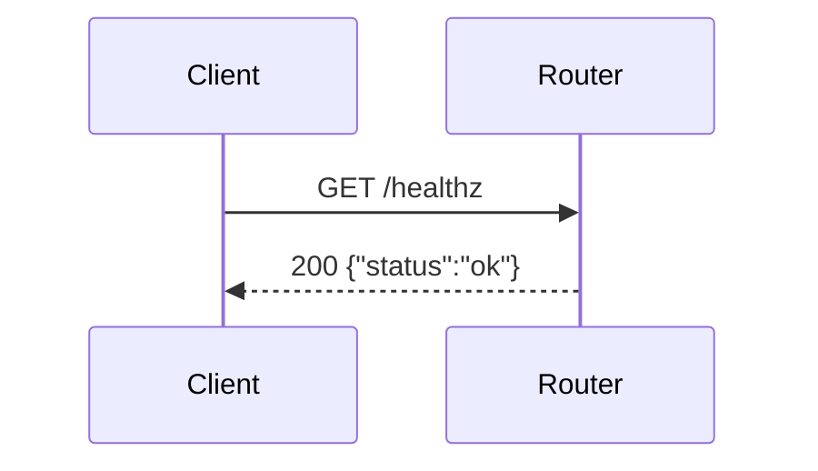

<!-- Expected: a slice in the post-#29 template shape. The optional
     `## Change outline` sits between `## What to build` and
     `## Conventions (from PRD)`; the extractors must return the same
     What-to-build and AC records as for the same body without it. -->

<!-- stenswf:v1
type: slice — AFK
lite_eligible: true
conventions_source: prd#42
prd_ref: 42
-->

## Parent PRD

#42

## What to build

Add a `/healthz` HTTP endpoint returning `{"status":"ok"}` with status
200.

## Change outline

```diff
 src/routes/
+├── healthz.ts        # GET /healthz → {"status":"ok"}
 └── index.ts          # registers healthz
```



## Conventions (from PRD)

None — slice-local decisions only.

## Acceptance criteria

- [ ] (behavior) `GET /healthz` returns 200 and JSON body `{"status":"ok"}`.
- [ ] (structural) Endpoint is registered in the main router.

## User stories addressed

- User story 1
