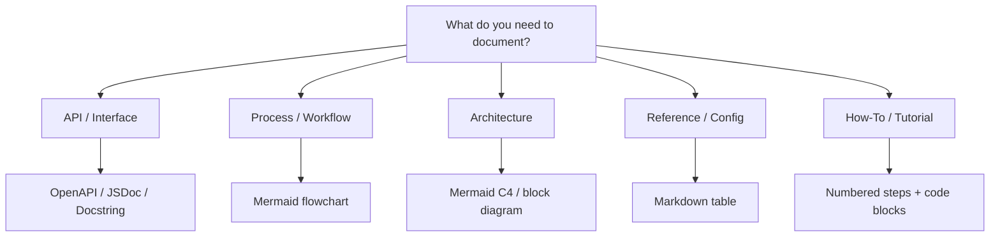
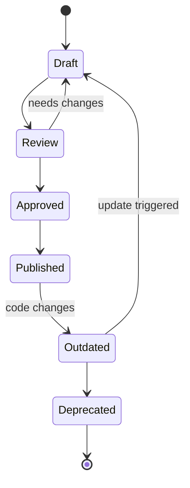
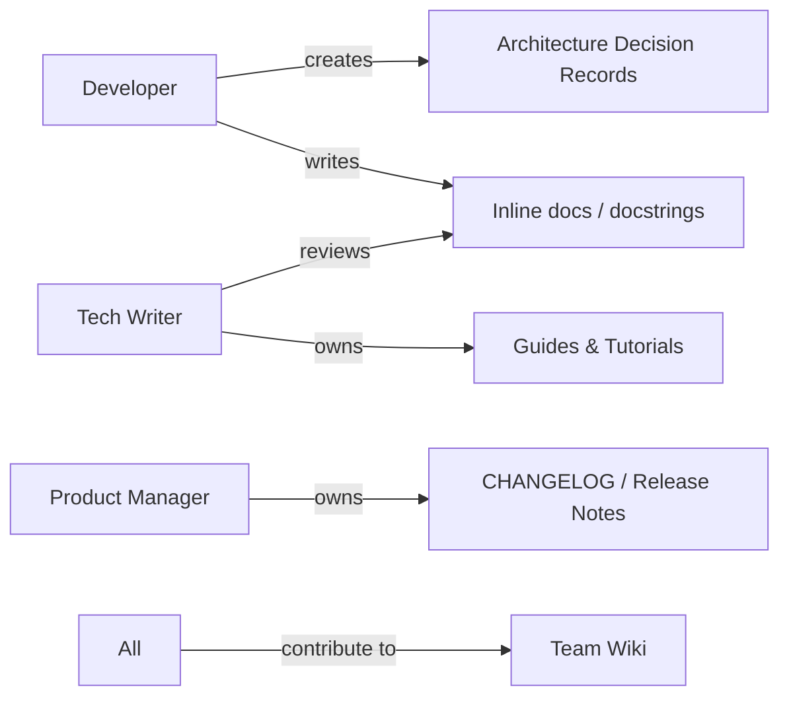
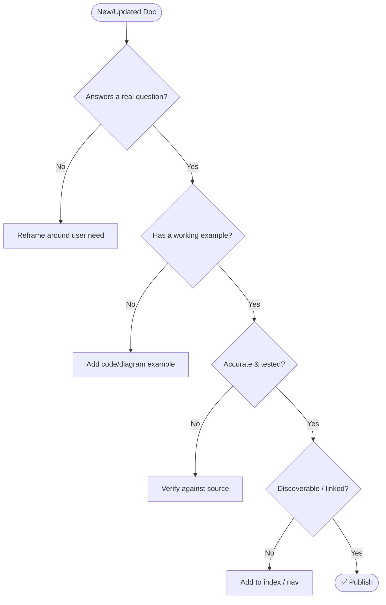

# SKILL: Documentation
> Diagram-first documentation patterns. Minimal prose. Use mermaid wherever structure exists.

---

## Doc Types & When to Use



---

## Documentation Lifecycle



---

## Ownership & Responsibility



---

## Doc Quality Checklist



---

## File Naming Convention

| Type | Pattern | Example |
|---|---|---|
| Guide | `how-to-<verb>-<topic>.md` | `how-to-deploy-api.md` |
| Reference | `ref-<topic>.md` | `ref-config-options.md` |
| ADR | `adr-<NNN>-<slug>.md` | `adr-042-auth-strategy.md` |
| Changelog | `CHANGELOG.md` | — |
| Skill file | `SKILL.md` | — |

---

## ADR Template

```markdown
# ADR-NNN: <Title>
- **Status:** proposed | accepted | deprecated | superseded
- **Date:** YYYY-MM-DD
- **Context:** Why this decision was needed.
- **Decision:** What was decided.
- **Consequences:** Trade-offs and impact.
```

---

## Docstring Template

```python
def fn(param: type) -> type:
    """
    One-line summary.

    Args:
        param: Description.

    Returns:
        Description.

    Raises:
        ErrorType: When/why.
    """
```

---

## Changelog Format (Keep a Changelog)

```markdown
## [1.2.0] - YYYY-MM-DD
### Added
- Feature X
### Changed
- Behavior Y
### Fixed
- Bug Z
### Deprecated / Removed / Security
```

---

## Mermaid Cheat Sheet

```mermaid
mindmap
  root((Mermaid))
    flowchart
      TD top-down
      LR left-right
    stateDiagram-v2
      states and transitions
    sequenceDiagram
      actor interactions
    classDiagram
      data models
    erDiagram
      DB schemas
    gantt
      timelines
    mindmap
      concept maps
```

---

## Mermaid Quick Syntax

| Diagram | Trigger words |
|---|---|
| `flowchart TD/LR` | process, flow, decision, pipeline |
| `sequenceDiagram` | API call, request/response, actors |
| `classDiagram` | model, object, inheritance, schema |
| `erDiagram` | database, table, relation |
| `stateDiagram-v2` | lifecycle, state machine, status |
| `gantt` | timeline, schedule, milestone |
| `mindmap` | concept map, overview, cheat sheet |

---

## AI Consumption Rules

1. Load this skill when any documentation task is detected.
2. Default to mermaid — only use prose when structure cannot be diagrammed.
3. Always apply the Doc Quality Checklist before finalising output.
4. Use file naming convention for any new files created.
5. Front matter is required on all SKILL.md and reference files.
